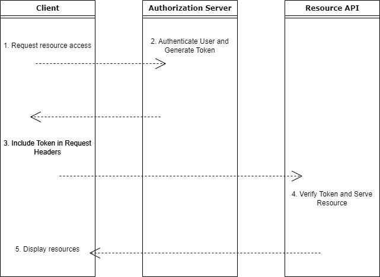

# Token-Based Authentication Example

This project provides an example implementation of token-based authentication using Flask. It includes three main files: authorization_server.py, resource_api.py, and client.py.

### **Description**

The project demonstrates a simple token-based authentication flow where a client obtains an authentication token from an authorization server and uses this token to access a protected resource API.

**authorization_server.py**: Simulates an authorization server that generates an authentication token upon successful authentication.

**resource_api.py**: Simulates a resource API that requires token-based authentication to access protected resources.

**client.py**: Simulates the interaction between a client and the resource API, including obtaining an authentication token and using it to access the resource.

The flow can be seen on the chart:

### **Usage**
1. Authorization Server:

Run the authorization server using the following command:
`python authorization_server.py`

The server will run on http://localhost:8000.

2. Resource API:

Run the resource API using the following command:
`python resource_api.py`

The API will run on http://localhost:8001.

3. Client Interaction:

Run the client script using the following command:
`python client.py`

The client script simulates the authentication process, prompting you to enter an authentication token. The token is created by the authorization server and needs to be copied from there. If the pasted token matches the one obtained from the authorization server, it accesses the resource API and displays the protected resource data.

### **Dependencies**
- Python 3.x
- Flask
- Requests
Install the required dependencies using the following command:
`pip install flask requests`

### **Contributing**
This project is a basic example, but contributions are welcome! Feel free to fork the repository and submit pull requests.

### **License**
This project is licensed under the MIT License.

### **Contact**
If you have any questions or suggestions, feel free to contact the project owner:

Name: Marek Zarzycki  
Email: contact@mazarzycki.com
